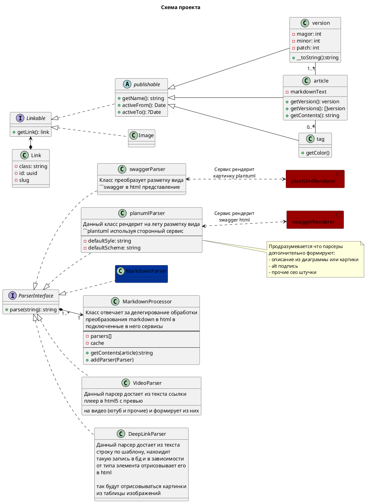

## Проект: Простой wiki движок
Публичная часть отдает html на остовании содержимого в базе
Все данные лежат в БД и представляют собой markdown документы с дополнительным функционалом:
- инлайн схемы plantuml рендарятся на лету в изображение
- инлайн схемы swagger рендарятся на лету в html
- инлайн ссылки на видео рендарятся на лету в html плеер
- нилайн ссылки на объекты бд рендарятся на лету в html

Закрытая часть предствляет собой админку, где можно быстро создаваь статьи 
редактор представляет собой текстовый редактор, с права от него онлайн превью 
так же редактор на лету позволяет добавлять сслкина обьектную модель по типу/тексту
Так же будет версионирование и редактирование сущностей, наример картинок

Версионирование будет идти по semver примерон так
<версия>.<количество публикаций>.<колличество сохраненных правок>
 - версия - по умолчанию 1, инкрементируется через админку
 - количество публикаций - увеличивается сразу после публикации.
 - колличество сохраненных правок - при внесении правок в опубликованный документ делается его копия контена, в которой при сохранении увеличивается данный параметр. При публикации обновляется количество публикаций а данный параметр становиться 0
  
Что будем использовать:
- docker
- sqllite
- symfony
- кастомный metaвata билдер, с логикой
- easy admin с CKeditor
- версионирование документов по semver
- поиск документов через elasticsearch
- тегирование докуметов

- написать нормальны стили самому

###  спринт 1
- [ ] настроить доккер контейнеры для php, nginx
- [ ] установить симфони 5.1, easyadmin
- [ ] настроить контейнер plantum
- [ ] настроить контейнер swagger 
- [ ] проверить интеграции

### спринт2
... пока в планах

