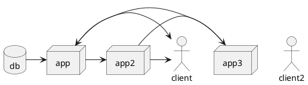
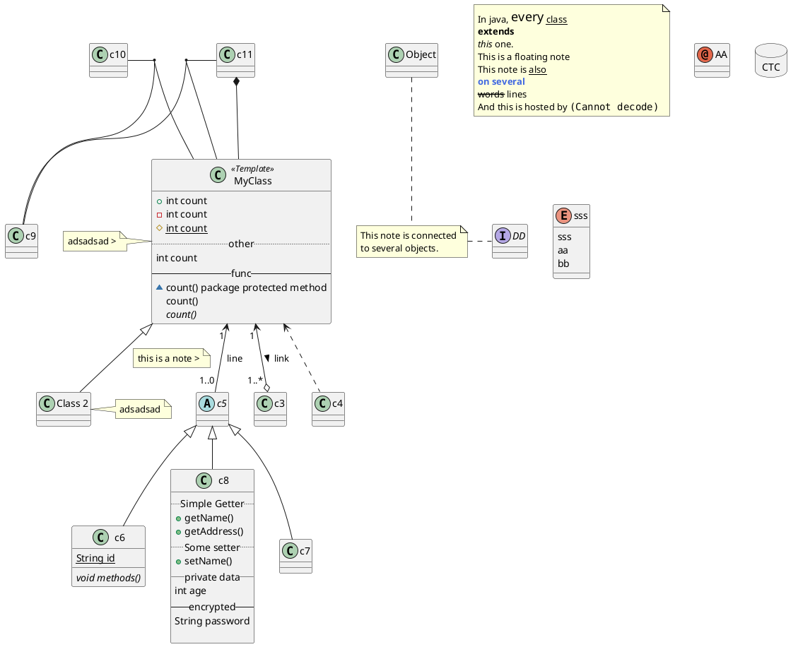
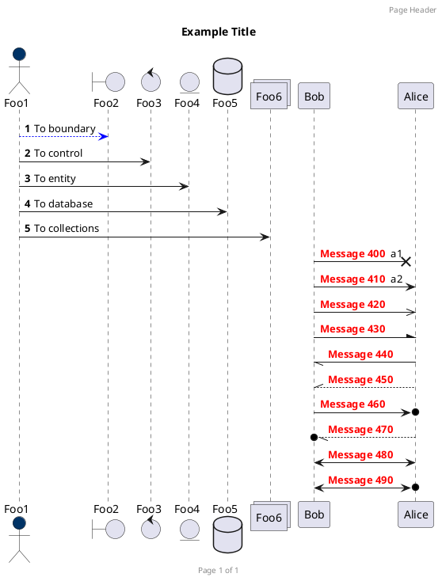
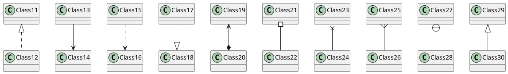
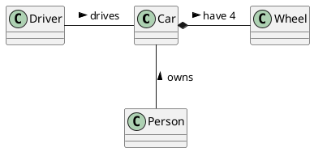
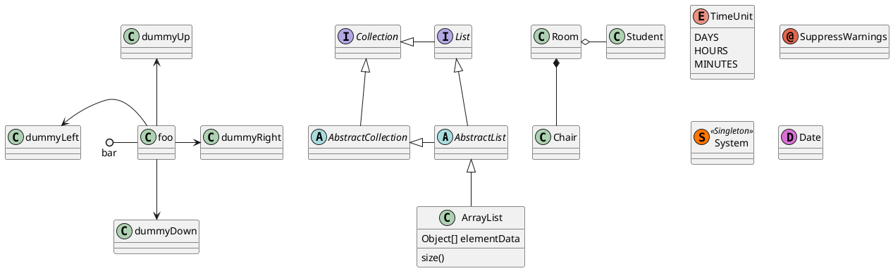
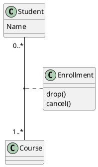
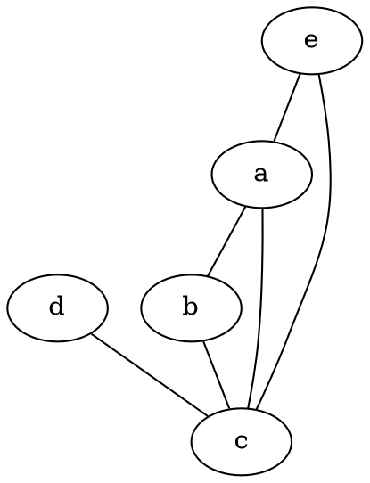

# GitHub-Flavored Markdown

## Краткое руководство

Абзацы создаются при помощи пустой строки. Если вокруг текста сверху и снизу есть пустые строки, то текст превращается в абзац.

Чтобы сделать перенос строки вместо абзаца,
нужно поставить два пробела в конце предыдущей строки.

Заголовки отмечаются диезом `#` в начале строки, от одного до шести. Например:

# Заголовок первого уровня #
## Заголовок h2
### Заголовок h3
#### Заголовок h4
##### Заголовок h5
###### Заголовок h6

В декоративных целях заголовки можно «закрывать» с обратной стороны.

### Списки

Для разметки неупорядоченных списков можно использовать или `*`, или `-`, или `+`:

- элемент 1
- элемент 2
- элемент ...

Вложенные пункты создаются четырьмя пробелами перед маркером пункта:

* элемент 1
* элемент 2
    * вложенный элемент 2.1
    * вложенный элемент 2.2
* элемент ...

Упорядоченный список:

1. элемент 1
2. элемент 2
    1. вложенный
    2. вложенный
3. элемент 3
4. Donec sit amet nisl. Aliquam semper ipsum sit amet velit. Suspendisse id sem consectetuer libero luctus adipiscing.

На самом деле не важно как в коде пронумерованы пункты, главное, чтобы перед элементом списка стояла цифра (любая) с точкой. Можно сделать и так:

0. элемент 1
0. элемент 2
0. элемент 3
0. элемент 4

Список с абзацами:

* Раз абзац. Lorem ipsum dolor sit amet, consectetur adipisicing elit.

* Два абзац. Donec sit amet nisl. Aliquam semper ipsum sit amet velit. Suspendisse id sem consectetuer libero luctus adipiscing.

* Три абзац. Ea, quis, alias nobis porro quos laborum minus sed fuga odio dolore natus quas cum enim necessitatibus magni provident non saepe sequi?

    Четыре абзац (Четыре пробела в начале или один tab).

### Цитаты

Цитаты оформляются как в емейлах, с помощью символа `>`.

> This is a blockquote with two paragraphs. Lorem ipsum dolor sit amet,
> consectetuer adipiscing elit. Aliquam hendrerit mi posuere lectus.
> Vestibulum enim wisi, viverra nec, fringilla in, laoreet vitae, risus.
>
> Donec sit amet nisl. Aliquam semper ipsum sit amet velit. Suspendisse
> id sem consectetuer libero luctus adipiscing.

Или более ленивым способом, когда знак `>` ставится перед каждым элементом цитаты, будь то абзац, заголовок или пустая строка:

> This is a blockquote with two paragraphs. Lorem ipsum dolor sit amet,
consectetuer adipiscing elit. Aliquam hendrerit mi posuere lectus.
Vestibulum enim wisi, viverra nec, fringilla in, laoreet vitae, risus.
>
> Donec sit amet nisl. Aliquam semper ipsum sit amet velit. Suspendisse
id sem consectetuer libero luctus adipiscing.

В цитаты можно помещать всё что угодно, в том числе вложенные цитаты:

> ## This is a header.
>
> 1.   This is the first list item.
> 2.   This is the second list item.
>
> > Вложенная цитата.
>
> Here's some example code:
>
>     return shell_exec("echo $input | $markdown_script");

### Исходный код

В чистом Маркдауне блоки кода отбиваются 4 пробелами в начале каждой строки.

Но в GitHub-Flavored Markdown (сокращенно GFM) есть более удобный способ: ставим по три апострофа (на букве Ё) до и после кода. Также можно указать язык исходного кода.

```javascript
function hello(name) {
    console.log(name);
}
```

```php
// Выключение протоколирования ошибок
error_reporting(0);

// Включать в отчет простые описания ошибок
error_reporting(E_ERROR | E_WARNING | E_PARSE);

// Включать в отчет E_NOTICE сообщения (добавятся сообщения о
// непроинициализированных переменных или ошибках в именах переменных)
error_reporting(E_ERROR | E_WARNING | E_PARSE | E_NOTICE);

// Добавлять сообщения обо всех ошибках, кроме E_NOTICE
error_reporting(E_ALL & ~E_NOTICE);

// Добавлять в отчет все ошибки PHP (см. список изменений)
error_reporting(E_ALL);

// Добавлять в отчет все ошибки PHP
error_reporting(-1);

// То же, что и error_reporting(E_ALL);
ini_set('error_reporting', E_ALL);
}
```

```html
<nav class="nav nav-primary">
  <ul>
    <li class="tab-conversation active">
      <a href="#" data-role="post-count" class="publisher-nav-color" data-nav="conversation">
        <span class="comment-count">0 комментариев</span>
        <span class="comment-count-placeholder">Комментарии</span>
      </a>
    </li>
    <li class="dropdown user-menu" data-role="logout">
      <a href="#" class="dropdown-toggle" data-toggle="dropdown">
        <span class="dropdown-toggle-wrapper">
          <span>
            Войти
          </span>
        </span>
        <span class="caret"></span>
      </a>
    </li>
  </ul>
</nav>
```

Самое приятное, что в коде не нужно заменять угловые скобки `< >` и амперсанд `&` на их html-сущности.

 - Cucumber ('*.feature')
 - abap ('*.abap')
 - ada ('*.adb', '*.ads', '*.ada')
 - ahk ('*.ahk', '*.ahkl')
 - apacheconf ('.htaccess', 'apache.conf', 'apache2.conf')
 - applescript ('*.applescript')
 - as ('*.as')
 - as3 ('*.as')
 - asy ('*.asy')
 - bash ('*.sh', '*.ksh', '*.bash', '*.ebuild', '*.eclass')
 - bat ('*.bat', '*.cmd')
 - befunge ('*.befunge')
 - blitzmax ('*.bmx')
 - boo ('*.boo')
 - brainfuck ('*.bf', '*.b')
 - c ('*.c', '*.h')
 - cfm ('*.cfm', '*.cfml', '*.cfc')
 - cheetah ('*.tmpl', '*.spt')
 - cl ('*.cl', '*.lisp', '*.el')
 - clojure ('*.clj', '*.cljs')
 - cmake ('*.cmake', 'CMakeLists.txt')
 - coffeescript ('*.coffee')
 - console ('*.sh-session')
 - control ('control')
 - cpp ('*.cpp', '*.hpp', '*.c++', '*.h++', '*.cc', '*.hh', '*.cxx', '*.hxx',  - '*.pde')
 - csharp ('*.cs')
 - css ('*.css')
 - cython ('*.pyx', '*.pxd', '*.pxi')
 - d ('*.d', '*.di')
 - delphi ('*.pas')
 - diff ('*.diff', '*.patch')
 - dpatch ('*.dpatch', '*.darcspatch')
 - duel ('*.duel', '*.jbst')
 - dylan ('*.dylan', '*.dyl')
 - erb ('*.erb')
 - erl ('*.erl-sh')
 - erlang ('*.erl', '*.hrl')
 - evoque ('*.evoque')
 - factor ('*.factor')
 - felix ('*.flx', '*.flxh')
 - fortran ('*.f', '*.f90')
 - gas ('*.s', '*.S')
 - genshi ('*.kid')
 - glsl ('*.vert', '*.frag', '*.geo')
 - gnuplot ('*.plot', '*.plt')
 - go ('*.go')
 - groff ('*.(1234567)', '*.man')
 - haml ('*.haml')
 - haskell ('*.hs')
 - html ('*.html', '*.htm', '*.xhtml', '*.xslt')
 - hx ('*.hx')
 - hybris ('*.hy', '*.hyb')
 - ini ('*.ini', '*.cfg')
 - io ('*.io')
 - ioke ('*.ik')
 - irc ('*.weechatlog')
 - jade ('*.jade')
 - java ('*.java')
 - js ('*.js')
 - jsp ('*.jsp')
 - lhs ('*.lhs')
 - llvm ('*.ll')
 - logtalk ('*.lgt')
 - lua ('*.lua', '*.wlua')
 - make ('*.mak', 'Makefile', 'makefile', 'Makefile.*', 'GNUmakefile')
 - mako ('*.mao')
 - maql ('*.maql')
 - mason ('*.mhtml', '*.mc', '*.mi', 'autohandler', 'dhandler')
 - markdown ('*.md')
 - modelica ('*.mo')
 - modula2 ('*.def', '*.mod')
 - moocode ('*.moo')
 - mupad ('*.mu')
 - mxml ('*.mxml')
 - myghty ('*.myt', 'autodelegate')
 - nasm ('*.asm', '*.ASM')
 - newspeak ('*.ns2')
 - objdump ('*.objdump')
 - objectivec ('*.m')
 - objectivej ('*.j')
 - ocaml ('*.ml', '*.mli', '*.mll', '*.mly')
 - ooc ('*.ooc')
 - perl ('*.pl', '*.pm')
 - php ('*.php', '*.php(345)')
 - postscript ('*.ps', '*.eps')
 - pot ('*.pot', '*.po')
 - pov ('*.pov', '*.inc')
 - prolog ('*.prolog', '*.pro', '*.pl')
 - properties ('*.properties')
 - protobuf ('*.proto')
 - py3tb ('*.py3tb')
 - pytb ('*.pytb')
 - python ('*.py', '*.pyw', '*.sc', 'SConstruct', 'SConscript', '*.tac')
 - rb ('*.rb', '*.rbw', 'Rakefile', '*.rake', '*.gemspec', '*.rbx', '*.duby')
 - rconsole ('*.Rout')
 - rebol ('*.r', '*.r3')
 - redcode ('*.cw')
 - rhtml ('*.rhtml')
 - rst ('*.rst', '*.rest')
 - sass ('*.sass')
 - scala ('*.scala')
 - scaml ('*.scaml')
 - scheme ('*.scm')
 - scss ('*.scss')
 - smalltalk ('*.st')
 - smarty ('*.tpl')
 - sourceslist ('sources.list')
 - splus ('*.S', '*.R')
 - sql ('*.sql')
 - sqlite3 ('*.sqlite3-console')
 - squidconf ('squid.conf')
 - ssp ('*.ssp')
 - tcl ('*.tcl')
 - tcsh ('*.tcsh', '*.csh')
 - tex ('*.tex', '*.aux', '*.toc')
 - text ('*.txt')
 - v ('*.v', '*.sv')
 - vala ('*.vala', '*.vapi')
 - vbnet ('*.vb', '*.bas')
 - velocity ('*.vm', '*.fhtml')
 - vim ('*.vim', '.vimrc')
 - xml ('*.xml', '*.xsl', '*.rss', '*.xslt', '*.xsd', '*.wsdl')
 - xquery ('*.xqy', '*.xquery')
 - xslt ('*.xsl', '*.xslt')
 - yaml ('*.yaml', '*.yml')


### Инлайн код

Для вставки кода внутри предложений нужно заключать этот код в апострофы (на букве Ё). Пример: `<html class="ie no-js">`.

Если внутри кода есть апостроф, то код надо обрамить двойными апострофами: ``There is a literal backtick (`) here.``

### Горизонтальная черта

`hr` создается тремя звездочками или тремя дефисами.

***


### Ссылки

Это встроенная [ссылка с title элементом](http://example.com/link "Я ссылка"). Это — [без title](http://example.com/link).

А вот [пример][1] [нескольких][2] [ссылок][id] с разметкой как у сносок. Прокатит и [короткая запись][] без указания id.

[1]: http://example.com/ "Optional Title Here"
[2]: http://example.com/some
[id]: http://example.com/links (Optional Title Here)
[короткая запись]: http://example.com/short

Вынос длинных урлов из предложения способствует сохранению читабельности исходника. Сноски можно располагать в любом месте документа.

### Emphasis

Выделять слова можно при помощи `*` и `_`. Одним символ для наклонного текста, два символа для жирного текста, три — для наклонного и жирного одновременно.

Например, это _italic_ и это тоже *italic*. А вот так уже __strong__, и так тоже **strong**. А так ***жирный и наклонный*** одновременно.

### Зачеркивание

В GFM добавлено зачеркивание текста: две тильды `~` до и после текста.

~~Зачеркнуто~~

## Картинки

Картинка без `alt` текста


Картинка с альтом и тайтлом:


Add Some Color to Your Life:
-  red!
-  purple!
-  green!


Картинка с указанным размером и обтеканием

Запомнить просто: синтаксис как у ссылок, только перед открывающей квадратной скобкой ставится восклицательный знак.

Картинки «сноски»:

![Картинка][image1]
![Картинка][image2]
![Картинка][image3]

[image1]: http://placehold.it/250x100
[image2]: http://placehold.it/200x100
[image3]: http://placehold.it/150x100

Картинки-ссылки:

[](http://example.com/)


## Использование HTML внутри Markdown

Mожно смешивать Markdown и HTML. Если на какие-то элементы нужно поставить классы или атрибуты, смело используем HTML:

> Выделять слова можно при помощи * и _ . Например, это <em class="a1">italic</em> и это тоже <i class="a1">italic</i>. А вот так уже <b>strong</b>, и так тоже <strong>strong</strong>.

Можно и наоборот, внутри HTML-тегов использовать Маркдаун.

<section class="someclass">

### Пример Маркдауна внутри HTML

Выделять слова можно при помощи `*` и `_` . Например, это _italic_ и это тоже *italic*. А вот так уже __strong__, и так тоже **strong**.

</section>

### Таблицы

В чистом Маркдауне нет синтаксиса для таблиц, а в GFM есть.

First Header  | Second Header
------------- | -------------
Content Cell  | Content Cell
Content Cell  | Content Cell

Для красоты можно и по бокам линии нарисовать:

| First Header  | Second Header |
| ------------- | ------------- |
| Content Cell  | Content Cell  |
| Content Cell  | Content Cell  |

Можно управлять выравниванием столбцов при помощи двоеточия.

| Left-Aligned  | Center Aligned  | Right Aligned |
|:------------- |:---------------:| -------------:|
| col 3 is      | some wordy text |     **$1600** |
| col 2 is      | centered        |         $12   |
| zebra stripes | are neat        |        ~~$1~~ |

Внутри таблиц можно использовать ссылки, наклонный, жирный или зачеркнутый текст.

Для всего остального есть обычный HTML.

Смайлы
---
:kissing: :laughing: :neutral_face:

Тудушки
---
- [x] @mentions, #refs, [links](), **formatting**, and tags supported
- [x] list syntax required (any unordered or ordered list supported)
- [x] this is a complete item
- [ ] this is an incomplete item

Расположение
---
<div align="center">This is center aligned!</div>
<div align="left">Left aligned</div>
<div align="right">Right aligned</div>

Скрытые блоки
---
<details>
  <summary>разверните описание в нутри</summary>
  ...описание
</details>

SHA references
---
Any reference to a commit’s SHA-1 hash will be automatically converted into a link to that commit on GitHub.

16c999e8c71134401a78d4d46435517b2271d6ac
mojombo@16c999e8c71134401a78d4d46435517b2271d6ac
mojombo/github-flavored-markdown@16c999e8c71134401a78d4d46435517b2271d6ac

Issue references within a repository
---
Any number that refers to an Issue or Pull Request will be automatically converted into a link.

mojombo#1
mojombo/github-flavored-markdown#1

Кнопки
---
<button class="button-save large">Big Fat Button</button>

Диаграммы
---






















<span style="color:red">some **This is Red Bold.** text</span>

Комментарий в самом маркдауне
---
[//]: # (This comment won't be rendered to the visitor!)

Сноски
---

ссылка[^1] на объясняющую сноску, как в книге.

[^1]: Заметка в конце блока или статьи. В данном случае - в конце блока.